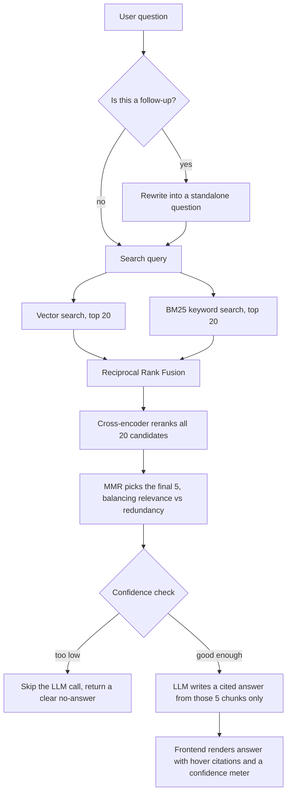
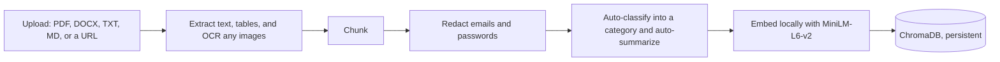

# DocIntel

**AI Document Intelligence and RAG Assistant** — ask questions across your company's documents and get answers grounded in exact, cited passages, not hallucinated guesses.

DocIntel isn't a single embedding-lookup-and-prompt demo. It's a multi-stage retrieval pipeline — hybrid search, cross-encoder reranking, diversity-aware selection, conversational query rewriting, and confidence-gated guardrails — wrapped in a document-management UI that understands PDFs, Word docs, plain text, Markdown, and live webpages.

---

## Why this is more than a tutorial RAG app

Most RAG walkthroughs stop at "embed the query, grab the top-k chunks, ask an LLM." DocIntel treats that as the *baseline*, not the destination:

| Typical tutorial RAG | DocIntel |
|---|---|
| Single vector search | **Hybrid search** — vector similarity + BM25 keyword search, merged with Reciprocal Rank Fusion |
| Top-k by raw similarity | **Cross-encoder reranking** — a second model re-scores candidates by actually reading the query and passage together |
| Whatever top-k comes out | **MMR diversity selection** — actively avoids handing the LLM five near-duplicate chunks that all repeat the same clause |
| Follow-up questions silently break | **Conversational query rewriting** — "what about their pricing?" is resolved into a standalone question *before* retrieval runs |
| Answers with no source | **Inline `[N]` citations** with hover popups showing the exact quoted passage |
| No sense of "was this a good answer?" | **Calibrated confidence scoring**, empirically tuned against real relevant/irrelevant queries — with a pre-LLM-call guardrail that skips the (paid) generation step entirely when retrieval confidence is too low |
| One document pile | **Multi-company organization** + a **Compare** feature for both company-vs-company Q&A and document-vs-document "what changed" diffing |

Every one of these was implemented against a real, reproduced failure case, not a hypothetical one — see [Design decisions & tradeoffs](#design-decisions--tradeoffs) for how a few of the harder calls were made.

---

## How a question actually gets answered



And how a document gets in, in the first place:



---

## Features

**Advanced retrieval**
- Hybrid search (vector + BM25, fused with RRF)
- Cross-encoder reranking (`cross-encoder/ms-marco-MiniLM-L-6-v2`, runs locally, zero API cost)
- MMR diversity selection to reduce redundant sources
- Conversational query rewriting for pronoun/context-dependent follow-ups
- Document-scoped search — an "Ask about" dropdown to search one specific document instead of the whole corpus, so a vague question like "what is this about" doesn't have to guess which document you mean

**Trust and safety**
- Two-layer confidence guardrail: skips the LLM call entirely on clearly unanswerable questions, and cleans up the display if the LLM refuses anyway
- Calibrated 0–100% confidence meter (good / warn / critical), tuned against real queries — not a made-up formula
- Inline `[N]` citations with hover popups showing the exact quoted source text
- PII redaction (emails and labeled passwords) applied at chunking time, before anything is stored

**Document understanding**
- Multi-format ingestion: PDF, DOCX, TXT, Markdown, and live webpages
- Table extraction and image OCR inside PDFs (not just plain text)
- Automatic 9-category classification (HR, Legal & Compliance, Security & IT, Engineering & Product, Finance, Sales & Marketing, Operations & Facilities, Executive & Strategy, Other) and one-line auto-summary per document
- Duplicate detection by content hash (files) or URL (webpages)

**Multi-company workspace**
- Every document tagged by company at upload time
- Document management UI: grouped by company, with category badges, chunk counts, and delete
- **Compare** mode, two ways:
  - *Company vs. company* — ask one question, get a side-by-side answer with independent confidence scores for each side
  - *Document vs. document* — pick two specific documents and get an "Added / Removed / Changed" diff

**Visibility**
- A live, streaming "what is it doing" trace for every question (retrieval → confidence → generation), not a generic spinner
- Structured logging (`docintel.log`) of every ask/compare call, including confidence, source count, timing, and rewritten queries

---

## Tech stack

| Layer | Choice |
|---|---|
| Backend API | FastAPI + Uvicorn, streaming responses (NDJSON) |
| Orchestration | LangChain (LCEL chains) |
| LLM | OpenAI `gpt-4o-mini` |
| Embeddings | HuggingFace `all-MiniLM-L6-v2`, local, normalized vectors |
| Vector store | ChromaDB, persistent, local |
| Keyword search | `rank-bm25` (BM25Okapi) |
| Reranking | `sentence-transformers` `CrossEncoder` |
| Frontend | Streamlit |
| Document parsing | PyMuPDF (PDF + OCR via `pytesseract`), `python-docx` |

Every dependency choice here was deliberate about weight: BM25 was picked over `langchain_community`'s retriever wrapper to keep the mechanism transparent and the dependency tiny; the cross-encoder reranker piggybacks on `sentence-transformers`, which was already installed for embeddings, so reranking added **zero** new dependencies.

---

## Getting started

### Prerequisites
- Python 3.12
- An OpenAI API key
- [Tesseract OCR](https://github.com/tesseract-ocr/tesseract) installed system-wide (used for scanning images embedded in PDFs) — e.g. `brew install tesseract` on macOS

### Setup

```bash
# 1. Clone and enter the project
git clone <this-repo>
cd DocIntel

# 2. Create and activate a virtual environment
python3 -m venv venv
source venv/bin/activate

# 3. Install dependencies
pip install -r requirements.txt

# 4. Configure your API key
echo "OPENAI_API_KEY=sk-..." > .env
```

### Run it

Two terminals, both from the project root:

```bash
# Terminal 1 — backend (http://127.0.0.1:8000)
cd backend
uvicorn main:app --reload
```

```bash
# Terminal 2 — frontend
cd frontend
streamlit run frontend.py
```

Streamlit will open the app in your browser.

---

## Using it

1. **Upload** — go to the Chat tab's sidebar, set a company name, and drop in a PDF, DOCX, TXT, or MD file (or paste a URL). You'll see an auto-generated category and summary immediately.
2. **Ask** — pick "General" or a specific document from the "Ask about" dropdown, then type a question. Watch the live status trace show retrieval, confidence, and generation as they actually happen. Ask a pronoun-based follow-up ("what about their...?") and see it get resolved before retrieval runs.
3. **Inspect** — hover any `[N]` citation to see the exact source passage it came from; check the confidence meter to gauge how grounded the answer is.
4. **Manage** — the Documents tab lists everything indexed, grouped by company, with one-click delete.
5. **Compare** — the Compare tab lets you either ask one question across two companies, or diff two specific document versions directly.

---

## API reference

| Method | Endpoint | Purpose |
|---|---|---|
| `POST` | `/documents/upload` | Upload a file (PDF/DOCX/TXT/MD) for one company |
| `POST` | `/documents/upload-url` | Ingest a webpage by URL |
| `GET` | `/documents` | List all indexed documents |
| `DELETE` | `/documents` | Delete a document and its chunks |
| `POST` | `/ask` | Ask a question (streaming NDJSON response) |
| `POST` | `/compare` | Compare two companies on one question (streaming) |
| `POST` | `/compare-documents` | Diff two specific documents (streaming) |

---

## Project structure

```
backend/
  main.py               # FastAPI routes — thin HTTP layer only
  chroma_db.py           # Owns all ChromaDB-specific logic
  retriever.py            # Hybrid search, reranking, MMR, confidence scoring
  call_llm.py             # All LLM prompts and chains (answer, compare, classify, summarize, query rewriting)
  document_ingestion.py   # PDF/DOCX/TXT extraction, table parsing, image OCR
  chunking.py              # Chunk splitting + PII redaction hook
  embedding.py             # Local embedding model
  pii_redaction.py         # Regex-based email/password redaction
frontend/
  frontend.py             # Streamlit UI — Chat, Documents, Compare tabs
```

---

## Design decisions & tradeoffs

- Dependency footprint was kept deliberately lean — e.g. regex-based PII detection instead of a full NER model, and a lightweight BM25 library instead of a heavier retrieval framework.
- Confidence scoring is empirically calibrated against real test queries, and was re-validated after adding reranking and MMR rather than assumed to still hold.
- Guardrails run in two stages, before and after the LLM call, so low-confidence questions never trigger an unnecessary paid generation step.
- The guardrail adapts to search scope — it only blocks generation for whole-corpus questions. When a specific document is chosen, a low score just means the wording doesn't closely match one chunk, not that the answer is missing, so the LLM still gets asked.

---

## License

[MIT](LICENSE)
